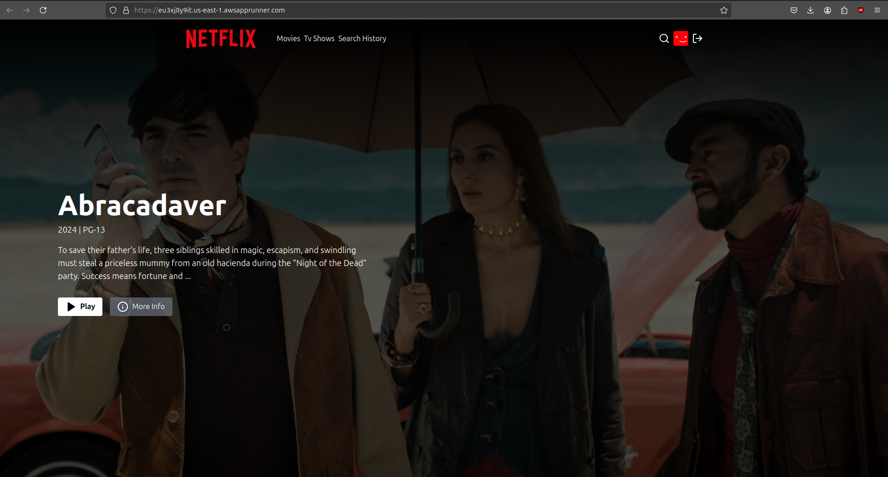

# Pain's Netflix

### Deployment
The app with my api keys and database is deployed and can be accessed at [https://eu3xj8y9it.us-east-1.awsapprunner.com/].

### Deployed site.


# Overall Architecture

The application follows a **client-server architecture** with a **React frontend** and a **Node.js/Express backend**. It uses **MongoDB** for data storage and integrates with **The Movie Database (TMDB) API** for fetching movie and TV show information.

## Backend Design

- **Server Setup (`/backend/server.js`)**:
  - Express.js server
  - Middleware configuration for JSON parsing and cookie handling
  - Database connection
  - Route definitions

- **Configuration (`/backend/config`)**:
  - Database connection setup
  - Environment variable management

- **Models (`/backend/models`)**:
  - User model definition using Mongoose

- **Controllers (`/backend/controllers`)**:
  - Authentication (signup, login, logout)
  - Movie data retrieval
  - TV show data retrieval
  - Search functionality

- **Routes (`/backend/routes`)**:
  - Authentication routes
  - Movie routes
  - TV show routes
  - Search routes

- **Middleware (`/backend/middleware`)**:
  - Route protection using JWT

- **Services (`/backend/services`)**:
  - TMDB API interaction

- **Utilities (`/backend/utils`)**:
  - JWT token generation

## Frontend Design

- **Main Application (`/frontend/src/App.jsx`)**:
  - Routing management
  - User authentication state

- **Components (`/frontend/src/components`)**:
  - Reusable UI elements (e.g., Footer, MovieSlider, Navbar)
  - Loading skeletons for improved UX

- **Pages (`/frontend/src/pages`)**:
  - Home page
  - Login page
  - Watch page
  - Other content pages

- **Custom Hooks (`/frontend/src/hooks`)**:
  - Data fetching hooks (e.g., `useGetTrendingContent`)

- **State Management**:
  - Zustand for managing authentication and content state

- **Utilities (`/frontend/src/utils`)**:
  - Constants
  - Date formatting functions

- **Styling**:
  - Tailwind CSS for responsive design
  - Custom scrollbar plugin

## Key Features

- User authentication (signup, login, logout)
- Trending movies and TV shows display
- Movie and TV show details, trailers, and similar content recommendations
- Search functionality for movies, TV shows, and people
- User search history management
- Responsive design for various screen sizes

## Development and Build Tools

- **Vite** for frontend development and building
- **ESLint** for code quality
- **PostCSS** with Tailwind CSS for styling
- **npm** for package management

### Setup .env file

```bash
PORT=5000
MONGO_URI=your_mongo_uri
NODE_ENV=development
JWT_SECRET=your_jwt_secre
TMDB_API_KEY=your_tmdb_api_key
```

### Run this app locally

```shell
npm run build
```

### Start the app

```shell
npm run start
```

### PAIN 
